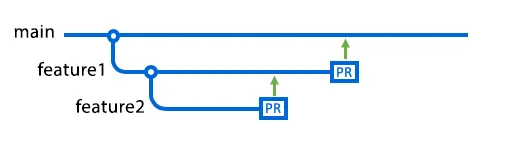

# Version Control

- A version control system enables user to track changes to the source code, logs all the changes and makes it easier to recover older versions of the files if mistakes are made.
- It also makes the collaboration with team really easy and smooth

---

## Types of Version Control?

There are two major types of Version Control Systems:
- CVCS [Centralised Version Control System]
- DVCS [Distributed Version Control System]

| **Feature** | **CVCS** | **DVCS** |
| ----- | ----- | ----- |
| **Repository** | Single central repository | Every user has a local repository |
| **Examples** | SVN, CVS, Perforce | Git, Mercurial, Bazaar |
| **Offline Access** | Limited [Requires connection to the central server] | Full access [works offline and can sync when you are back online] |
| **Commit Process** | Changes are committed directly to the central server | Changes are committed locally first, then pushed to the remote |
| **Branching and Merging** | Limited and more complex | Flexible, efficient, and easier to manage |
| **Performance** | Slower for large projects due to frequent server access | Faster for local operations, as all data is local |
| **Fault Tolerance** | Single point of failure [central server] | More robust [any local copy can act as a backup] |
| **Collaboration** | Requires users to commit directly to the central server | More flexible as users can work independently and sync later |
| **Complexity** | Simpler to use and manage | More complex due to local repositories and syncing |
| **Use Case** | Small to medium teams, smaller projects | Large teams, open-source projects, distributed development |

---

## What is git?

- Git is a free and open source software which uses Distributed Version Control System [DVCS in short] which means users present in any part of the world can easily access a copy of their projects on their computers.
- Any changes can be synced with a remote server and then accessed.
- Git isn't the only version control system but due to the DVCS aspect it is more widely used.

---

## What git offers

- **Remote access:** You can easily access your code anywhere and make changes remotely to your code and log the changes too.
- **Branching:** Use of feature branching to make multiple copeis of codes to make and test various changes to the code.

Note: There are the very basic features git offers, apart from these there are various others facilities and features offered by git.

---

## What is Github?

Github is a web service that provides easy to use git functionality. It is the most widely used website for git but other alternatives available include: Git Lab, Bitbucket etc.

---

## Terms associated with Git and Github

- **SSH:** Secure SHell protocol or SSH protocol is a method to remotely login from one computer to another.

- **Repository:** A Repository or a Repo is a storage location where all the files, directories, and version history related to a specific project are stored. It is typically managed using a version control system. The repository serves as the project’s root folder and contains everything needed for the project, including code, documentation, configuration files, and the history of changes made over time.

- **Fork:** Fork is used to copy a repo.

- **Pull request:** Pull request is used to request for review and approval of changes before they are finalized and added to the main source code.

- **Working Directory:** A Working Directory contains files and subdirectories on the system associated with the git repo.

- **Commit:** Commit is a snapshot or an instant in the source code in a specific point of time along with a description when changes are made in the repo.

- **Branch:** Branch is a separate line of development that allows users to work and test new features and also fixes without affecting the source code.

- **Merge:** Merging combines changes from one branch to another. It is typically used to merge a feature/fix branch into the main branch.

- **Clone Repo:** Cloning a repo creates a copy of a remote git repo into the local system.

---

## Why is Git Repository Model special?

- Based on DVCS
- Primary focus to track source code development
- Easy coordination among programmers
    - Track changes
    - Non linear workflow support

---

## Git Branches

- All files in github are stored on branches.
- Main branch: Stores deployable code.
- Main branch created by default. [user can make any branch as main, finished deployable version]
- 
    - As changes are made, the new branches holds the changes.
- 
    - When two branches are ready to merge, each branch's code is identified as a tip.
    - Two tips are merged into a third, combined branch.

---

## Git Commits

- Saved changes are called commits.
- This indicates that the developer is sure the code represents a stable platform for the feature or set of features under development.
- While commiting, developer should use a meaningfull comment for that commit to later refer if needed.
- Commit can be done in the main branch directly or can create a new branch.

---

## Git pull

- Used to initiate the merging of branches in a way to review changes
- Git pull makes the commit changes available for others to review and use.
- Pull always requires user to approve the changes [author of the change]
- Log files record the approval of the merge.

Note: Github automatically makes a pull request on your behalf if you make changes on a branch that you don't own.

---

## Git workflow

- 1. ***Clone repo from github:*** Creates a copy of repo on local system including code and version history
- 2. ***Create branch:*** Work on the new created branch to test any features or edits os the sorurce code is not affected
- 3. ***Staging area:*** Select the changed files and move them to a staging area. These files are then pushed into the local repo
- 4. ***Commit:*** Commiting the files allows git to record the changes and ensures that the added features become a part of the branch
- 5. ***Push:*** Push the commited changes into the remote repository so as others can access the feature and evaluate it
- 6. ***Review code:*** Added feature/code has to be reviewed by the repo managing user
- 7. ***Pull request:*** To ask for review the user has to make a pull request
- 8. ***Merge branch:*** After review, the maintainer of repo merges the branches