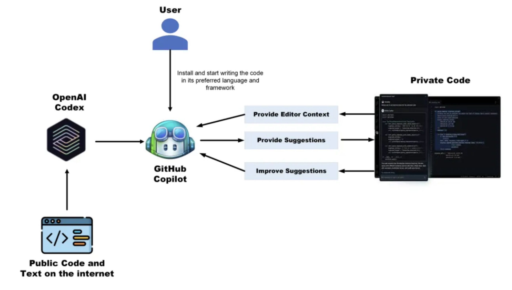

# GitHub Copilot

GitHub Copilot is an AI-powered code assistant designed to help users write code faster and more efficiently by providing intelligent suggestions. It works seamlessly as a plugin for various code editors, making it easy to integrate into your workflow.

## Features of GitHub Copilot

- **Code Autocompletion**: Automatically suggests code as you type, reducing boilerplate.
- **Real-time Suggestions**: Provides coding suggestions in real-time, helping you write more efficiently.
- **Contextual Suggestions**: Learns from your code and context to offer relevant and intelligent suggestions.
- **Supports Multiple Programming Languages**: GitHub Copilot supports a wide range of programming languages, including Python, JavaScript, TypeScript, Ruby, and more.
- **Seamless IDE Integration**: Easily integrates with popular Integrated Development Environments (IDEs) like Visual Studio Code, JetBrains, and others.
- **Learns from Shared Knowledge**: Copilot benefits from a broad training dataset that reflects best practices from a diverse range of codebases.

## GitHub Copilot Workflow

This image illustrates the typical workflow when using GitHub Copilot in your development environment.
